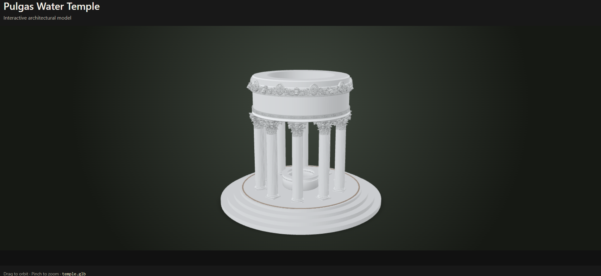

# Pulgas Water Temple viewer

Live viewer: [boxwrench.github.io/water_temple](https://boxwrench.github.io/water_temple/)

## About the temple

The Pulgas Water Temple is a stone structure in Redwood City, California, designed by architect William G. Merchant. The San Francisco Water Department built it to commemorate the 1934 completion of the Hetch Hetchy Aqueduct. The permanent temple was completed in 1938 and consists of a circle of fluted Corinthian columns supporting a large masonry ring; the original ring carried a quotation from Isaiah 43:20. A reflecting pool lined with cypress trees completes the setting. Water no longer flows through the temple, having been diverted to a nearby treatment plant. [Read more on Wikipedia](https://en.wikipedia.org/wiki/Pulgas_Water_Temple).

## This project

This is a browser presentation of a Blender reconstruction/study of the temple. The workflow is:

1. Build and refine the architectural parts in Blender, including the columns, Corinthian capitals, cornice, frieze, well, and ornamental details — the scripts in `scripts/` and the method behind them in `docs/PIPELINE-GUIDE.md`.
2. Keep the built `.blend` checkpoints in `temple-model/` and the decimated real-time/game LOD tiers in `lod/`.
3. Export the selected model to a binary glTF `.glb` for efficient browser delivery.
4. Present the model with Google's [`<model-viewer>`](https://modelviewer.dev/) component, using responsive HTML/CSS, touch orbit, pinch zoom, shadows, auto-rotate, and optional AR.
5. Publish the static viewer and model through GitHub Pages.

`temple-model/` holds four checkpoints, each an endpoint or an upstream input (see `docs/PIPELINE-GUIDE.md` §17 for the naming convention): the preserved pre-donor state, the original pre-swap temple, the current chain's starting point, and the current full-detail model. `lod/` holds that model repaired and decimated into three real-time tiers, named by their own measured triangle count rather than a nominal target (`lod680k`, `lod210k`, `lod86k` — see §15/§16 for why).

`scripts/` is the full build pipeline as it was actually run, kept for provenance and method, not as a one-command rebuild: it expects a `masters/` (reusable ornament geometry) and `donors/` (raw source `.glb`/reference imagery) directory that are not published here, since they're large working inputs rather than the deliverable. `scripts/paths.py` is the single source of truth for the expected layout if you want to reconstruct it.

The original engraved quotation on the drum was removed for the published web variant. An early attempt did this by editing the decimated web-export mesh directly and left visible ghosting where the lettering had been (`docs/PIPELINE-GUIDE.md` §10 has the full account). The current `temple-model/` and `lod/` fix this properly, by rebuilding the drum from its measured dimensions as clean primitive geometry rather than editing around the old carved topology — but `assets/temple.glb` below is a web export from before that fix, so the live viewer still shows the earlier workaround pending a re-export.

## Blender export

Use **File > Export > glTF 2.0 > glTF Binary (.glb)**. Export the temple as `assets/temple.glb`; apply modifiers and embed textures. For phones, optimize textures and geometry before publishing.
